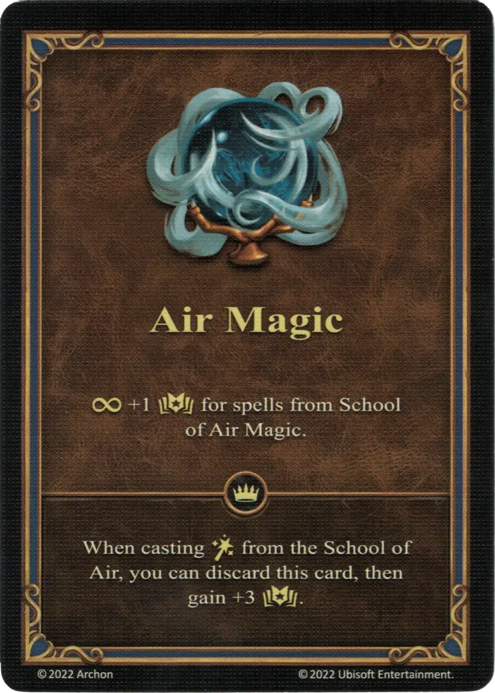

# Magia Aérea

{ width="340" align=right }

___

[Habilidad](index.md)

___

:permanent: +1 :empower: para hechizos de la [Escuela de Magia Aérea](../spells/school_of_air_magic.md).

___

 :expert: 

Mientras lanzas :spellpower: de la [Escuela de Aire](../spells/school_of_air_magic.md), puedes descartar esta carta, entonces ganas +3 :empower:.

___

## Notas

- El efecto experto puede jugarse desde la mano o desde el campo. Esto, sin embargo, no suma los dos efectos, y la habilidad se pone en la pila de descartes después de ser jugada.
- Ver [Efecto Permanente](../keywords/permanent_effect.md)

## Viene Con

- [Expansión de Torre](../content/tower_expansion.md)

## Ver También

- [Lista de Habilidades](index.md)
- [Escuela de Magia Aérea](../spells/school_of_air_magic.md)
