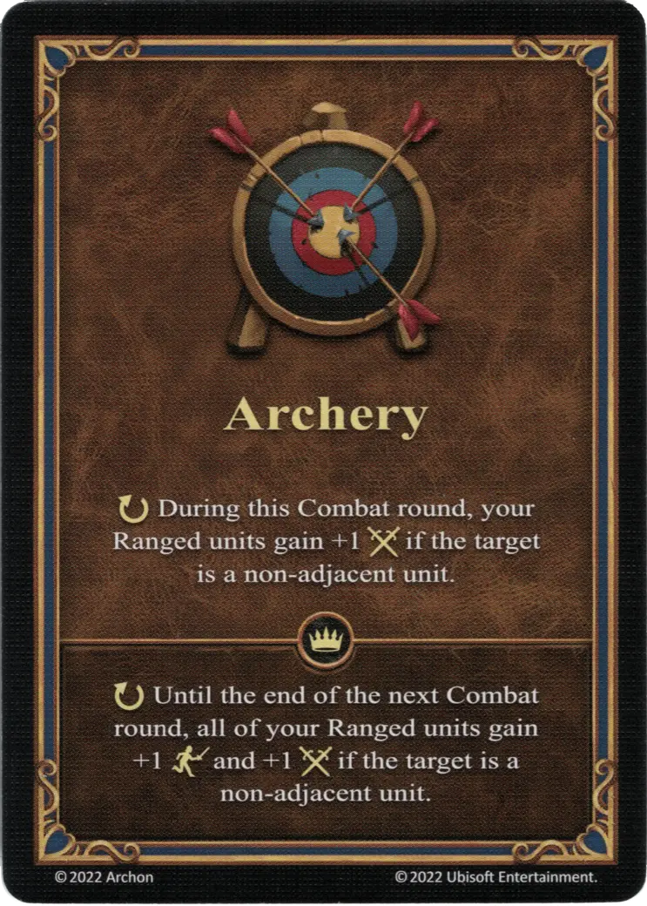

# Tiro con Arco

{ width="340" align=right }

___

[Habilidad](index.md)

___

:ongoing: Durante esta ronda de Combate, tus [unidades a Distancia](../keywords/ranged_unit.md) gana +1 :attack: si la [unidad](../units/index.md) objetivo no está adyacente.

___

 :expert: 

:ongoing: Hasta el final de la siguiente ronda de Combate, tus [unidades a Distancia](../keywords/ranged_unit.md) ganan +1 :initiative: y +1 :attack: si la [unidad](../units/index.md) objetivo no está adyacente.

___

## Héroes con Habilidad de Inicio

- [:might: Gelu](../heroes/gelu.md)
- [:might: Valeska](../heroes/valeska.md)
- [:might: Wystan](../heroes/wystan.md)

## Notas

- Esta habilidad se activa durante cada ataque a distancia de la ronda de Combate, lo que significa que se aplica a ambos ataques de [Elfos](../units/elves.md) y [Ballesteros](../units/marksmen.md).

## Viene Con

- [Juego Principal](../content/core_game.md)

## Ver También

- [Lista de Habilidades](index.md)
- [Lista de Unidades a Distancia](../keywords/ranged_unit.md)
