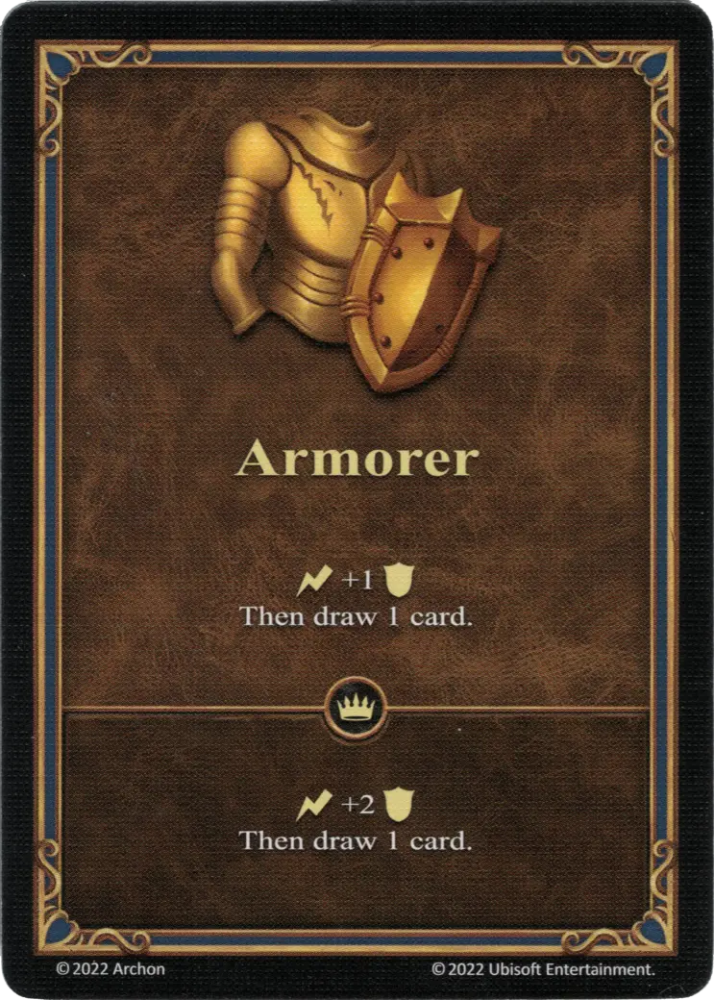

# Armero

{ width="340" align=right }

___

[Habilidad](index.md)

___

:instant: +1 :defense: Luego roba 1 carta.

___

 :expert: 

:instant: +2 :defense: Luego roba 1 carta.

___

## Héroes con Habilidad de Inicio

- [:might: Gerwulf](../heroes/gerwulf.md)
- [:might: Tarnum](../heroes/tarnum_fortress.md)
- [:might: Tazar](../heroes/tazar.md)

## Notas

- El armero también se puede jugar fuera del combate, para dibujar una carta. En tal caso, el bono de defensa no se usa y se pierde.

## Viene Con

- [Juego Principal](../content/core_game.md)

## Ver También

- [Lista de Habilidades](index.md)
