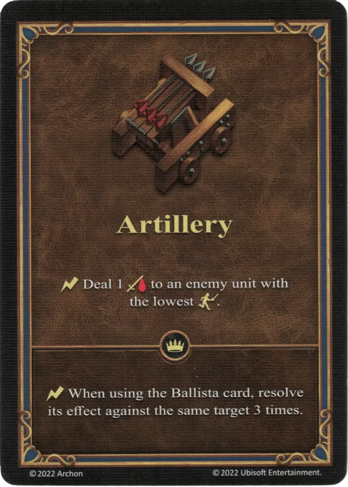

# Artillería

{ width="340" align=right }

___

[Habilidad](index.md)

___

:instant: Inflinge 1 :damage: a la [unidad](../units/index.md) enemiga con la menor :initiative:.

___

 :expert: 

:instant: Cuando estés usando la carta de [Ballesta](../war_machines/ballista.md), resuelve su efecto contra el mismo objetivo 3 veces.

___

## Héroes con Habilidad de Inicio

- [:might: Pasis](../heroes/pasis.md)
- [:might: Tarnum (Castillo)](../heroes/tarnum_castle.md)

## Notas

- Si varias unidades enemigas comparten la misma iniciativa (más baja), el jugador puede elegir a cuál de esas unidades debería hacer daño esta habilidad.
- El efecto experto solo se puede jugar cuando se activa [Ballesta](../war_machines/ballista.md), lo que solo puede ocurrir al comienzo de cada ronda de Combate.
- Sin una [Ballesta](../war_machines/ballista.md) activa, solo se puede resolver el efecto básico de esta habilidad.
- En combinación con [Los Astrólogos proclaman la semana del Carro de Munición](../astrologers_proclaim/ammo_cart.md) el efecto experto infligirá 3 veces 2 de daño, es decir, 6 de daño en total.

## Viene Con

- [Expansión de Muralla](../content/rampart_expansion.md)

## Ver También

- [Lista de Habilidades](index.md)
