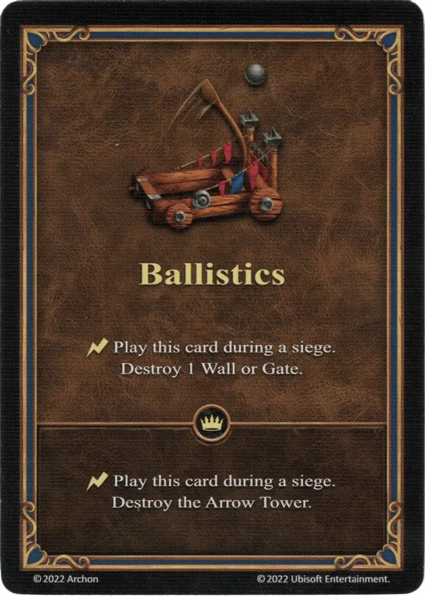

# Balística

{ width="340" align=right }

___

[Habilidad](index.md)

___

:instant: Juega esta carta durante un asedio. Destruye 1 Muro o Puerta.

___

 :expert: 

:instant: Juega esta carta durante un asedio. Destruye la  [Torre de Arqueros](../units/arrow_tower.md).

___

## Viene Con

- [Expansión de Infierno](../content/inferno_expansion.md)

## Ver También

- [Lista de Habilidades](index.md)
