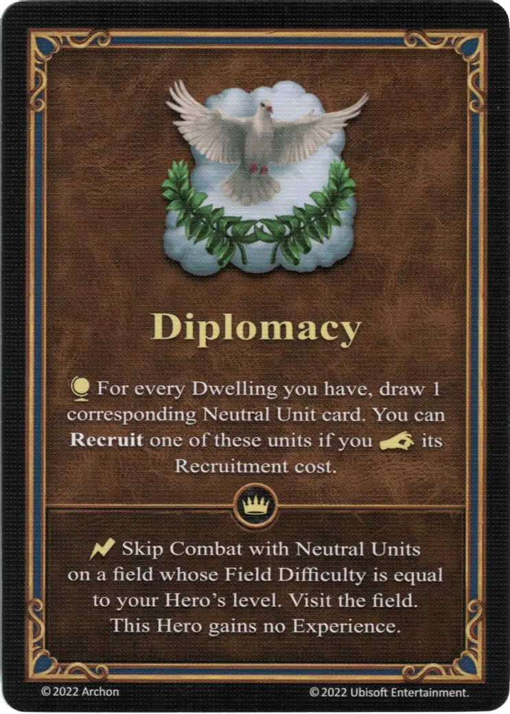

# Diplomacia

{ width="340" align=right }

___

[Habilidad](index.md)

___

:effect_map: Por cada Vivienda que tengas, roba 1 carta de la [Unidad Neutral](../units/index.md) correspondiente. Puedes **Reclutar** una de estas [unidades](../units/index.md) si :pay: su coste de Reclutamiento..

___

 :expert: 

:instant: Salta el Combate con [Unidades Neutrales](../units/index.md) en una zona cuya Dificultad de Zona sea igual al nivel de tu Héroe. Visita el lugar. Este Héroe no gana Experiencia.

___

## Héroes con Habilidad de Inicio

- [:magic: Cyra](../heroes/cyra.md)

## Notas

- Si el jugador ya tiene una vivienda :golden:, roba cartas de ambos mazos Neutrales, el :golden: y el :azure:.
- Los costes de reclutamiento de las unidades neutrales se encuentran en la ficha de la unidad correspondiente.
- Para el reclutamiento que ocurre como resultado del uso de esta habilidad, la ficha de reclutamiento no será volteada. Esto significa que esta habilidad puede utilizarse incluso después de que el jugador ya haya reclutado unidades durante esta ronda.
- [^1] Cuando se juega con miniaturas (ej. cuando se juega en el gran campo de batalla), esta habilidad no puede utilizarse para reclutar unidades de una facción controlada por otro jugador, ni para reclutar unidades neutrales que ya estén reclutadas por otro jugador. Si un jugador roba una carta de este tipo, que no puede ser reclutada, deberá robar una carta de reemplazo en su lugar.

## Viene Con

- [Juego Principal](../content/core_game.md)

## Ver También

- [Lista de Habilidades](index.md)

[^1]: Excepciones para modos de juego específicos. Esta explicación no es válida para todos los modos de juego. La variante específica para el modo de juego se menciona en el texto.
