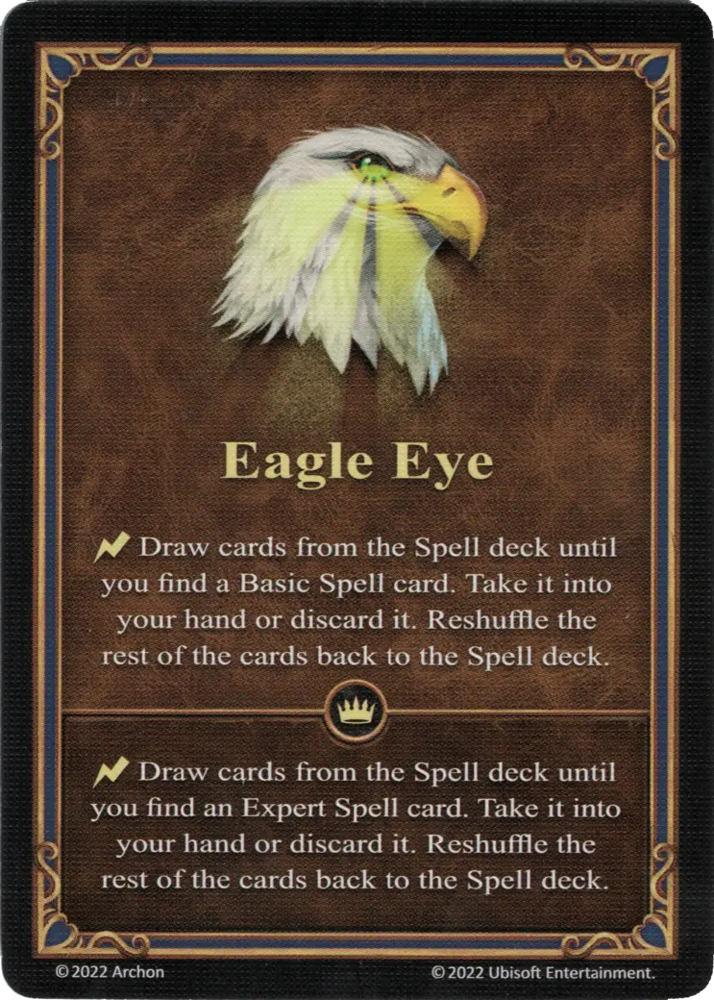

# Ojo de Águila

{ width="340" align=right }

___

[Habilidad](index.md)

___

:instant: Roba cartas del mazo de [Hechizos](../spells/index.md) hasta que encuentres una carta de [Hechizo](../spells/index.md) Básico. Cógela en tu mano o descártala. Vuelve a barajar el resto de cartas en el mazo de [Hechizos](../spells/index.md).

___

 :expert: 

:instant: Roba cartas del mazo de [Hechizos](../spells/index.md) hasta que encuentres una carta de [Hechizo](../spells/index.md) Experto. Cógela en tu mano o descártala. Vuelve a barajar el resto de cartas en el mazo de [Hechizos](../spells/index.md).

___

## Héroes con Habilidad de Inicio

- [:magic: Ash](../heroes/ash.md)

## Viene Con

- [Expansión de Fortaleza](../content/fortress_expansion.md)

## Ver También

- [Lista de Habilidades](index.md)
- [Lista de Hechizos](../spells/index.md)
