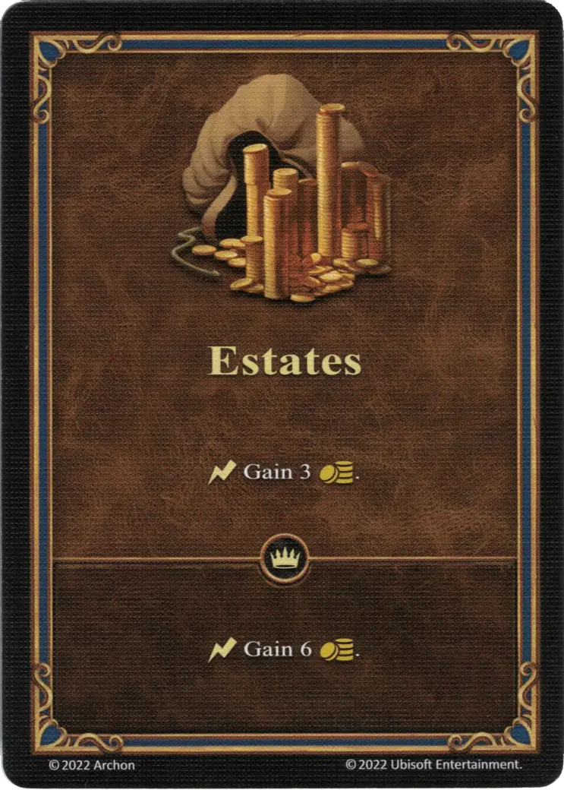

# Patrimonio

{ width="340" align=right }

___

[Habilidad](index.md)

___

:instant: Gana 3 :gold:.

___

 :expert: 

:instant: Gana 6 :gold:.

___

## Héroes con Habilidad de Inicio

- [:might: Erdamon](../heroes/erdamon.md)
- [:might: Lord Haart (Castillo)](../heroes/lord_haart_castle.md)
- [:magic: Tarnum (Mazmorra)](../heroes/tarnum_dungeon.md)

## Viene Con

- [Juego Principal](../content/core_game.md)

## Ver También

- [Lista de Habilidades](index.md)
