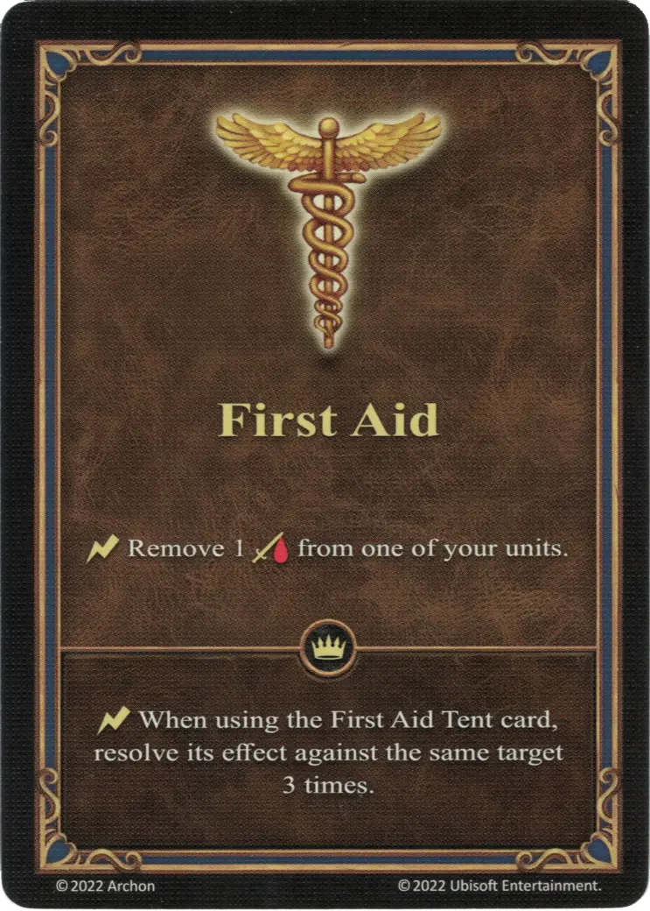

# Primeros Auxilios

{ width="340" align=right }

___

[Habilidad](index.md)

___

:instant: Retira 1 :damage: de una de tus [unidades](../units/index.md).

___

 :expert: 

:instant: Al usar la carta [Tienda de Primeros Auxilios](../war_machines/first_aid_tent.md), resuelve su efecto contra el mismo objetivo 3 veces.

___

## Héroes con Habilidad de Inicio

- [:magic: Gem](../heroes/gem.md)
- [:magic: Merist](../heroes/merist.md)

## Notas

- El efecto experto sólo puede jugarse cuando se activa la [Tienda de Primeros Auxilios](../war_machines/first_aid_tent.md), lo que sólo puede ocurrir al principio de cada ronda de Combate.
- Sin una [Tienda de Primeros Auxilios](../war_machines/first_aid_tent.md) activa, sólo se puede resolver el efecto básico de esta habilidad.

## Viene Con

- [Expansión de Muralla](../content/rampart_expansion.md)

## Ver También

- [Lista de Habilidades](index.md)
