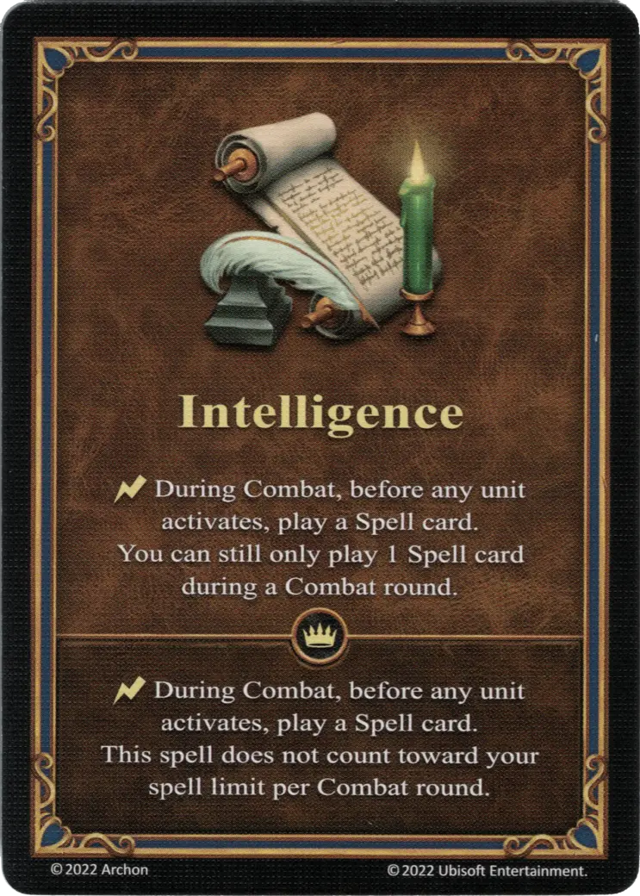

# Inteligencia

{ width="340" align=right }

___

[Habilidad](index.md)

___

:instant: During Combat, before any [unit](../units/index.md) activates, play a [Spell](../spells/index.md) card. You can still only play a [Spell](../spells/index.md) card during a Combat round.

___

 :expert: 

:instant: During Combat, before any [unit](../units/index.md) activates, play a [Spell](../spells/index.md) card. This spell does not count toward your spell limit per Combat round.

___

## Héroes con Habilidad de Inicio

- [:might: Iona](../heroes/iona.md)
- [:magic: Sephinroth](../heroes/sephinroth.md)

## Notas

- Si ambos jugadores están resolviendo cartas con efectos al comienzo del combate (por ejemplo, jugar inteligencia), el atacante (o el jugador con el token de iniciativa) puede resolver primero su carta.
- Esta habilidad solo se puede jugar al comienzo del combate en sí, no al comienzo de ninguna ronda de combate.

## Viene Con

- [Juego Principal](../content/core_game.md)

## Ver También

- [Lista de Habilidades](index.md)
- [Lista de Hechizos](../spells/index.md)
