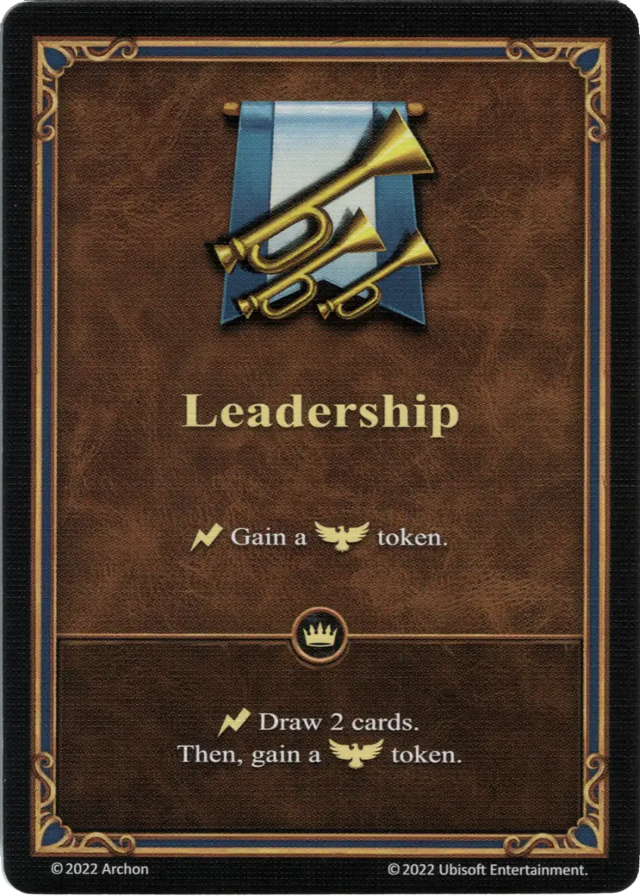

# Liderazgo

{ width="340" align=right }

___

[Habilidad](index.md)

___

:instant: Gain a :morale_positive: token.

___

 :expert: 

:instant: Draw 2 cards. Then, gain a :morale_positive: token.

___

## Héroes con Habilidad de Inicio

- [:might: Catherine](../heroes/catherine.md)
- [:might: Mephala](../heroes/mephala.md)
- [:might: Tarnum (Rampart)](../heroes/tarnum_rampart.md)

## Viene Con

- [Juego Principal](../content/core_game.md)

## Ver También

- [Lista de Habilidades](index.md)
