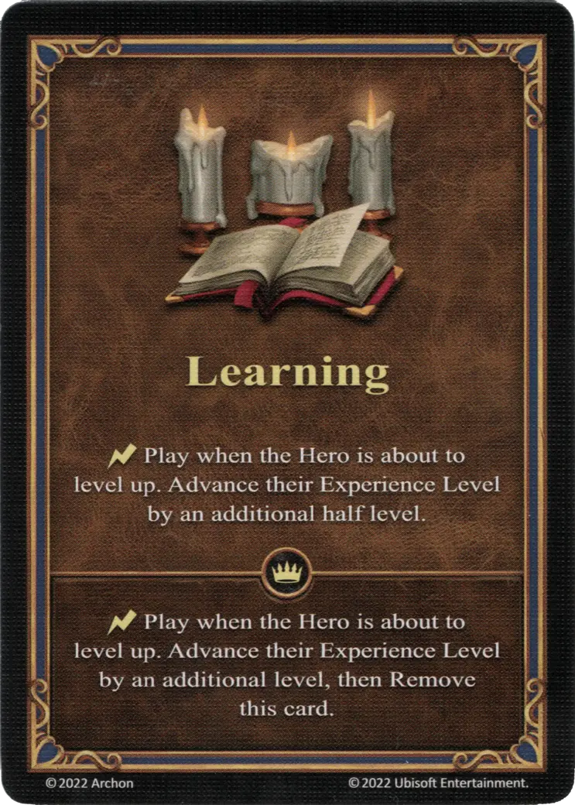

# Aprendizaje

{ width="340" align=right }

___

[Habilidad](index.md)

___

:instant: Play when the [Hero](../heroes/index.md) is about to level up. Advance their Experience Level by an additional half level.

___

 :expert: 

:instant: Play when the [Hero](../heroes/index.md) is about to level up. Advance their Experience Level by an additional level, then Remove this card.

___

## Viene Con

- [Expansión de Fortaleza](../content/fortress_expansion.md)

## Ver También

- [Lista de Habilidades](index.md)
