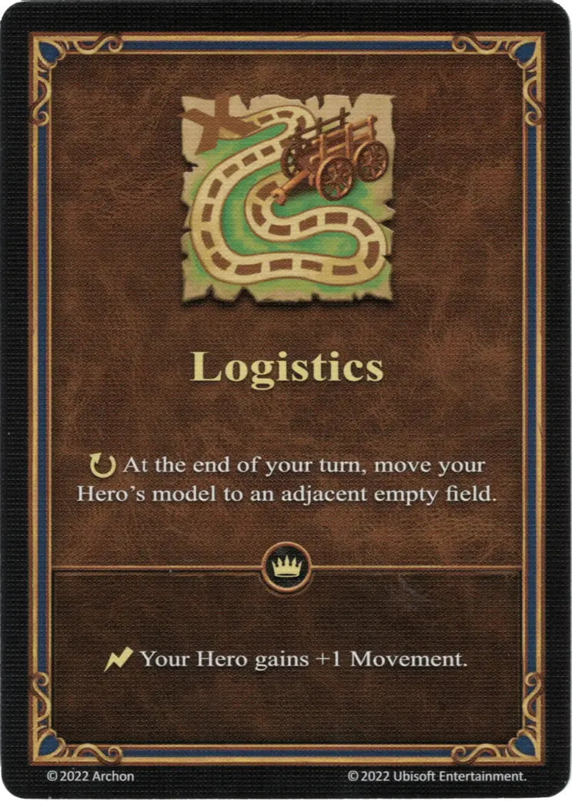

# Logística

{ width="340" align=right }

___

[Habilidad](index.md)

___

:ongoing: At the end of your turn, move your Hero's model to an adjacent empty field.

___

 :expert: 

:instant: Your Hero gains +1 Movement.

___

## Héroes con Habilidad de Inicio

- [:magic: Dessa](../heroes/dessa.md)
- [:might: Miriam](../heroes/miriam.md)
- [:might: Monere](../heroes/monere.md)

## Notas

- Los campos se consideran vacíos si no pueden proporcionar un efecto o ya no proporcionar un efecto.Esto significa que los campos con cubos negros o los cubos de facción del jugador cuentan como vacíos.
- El punto de movimiento adicional también se puede otorgar al héroe secundario.
- El punto de movimiento adicional es el efecto de uso único, no aumenta permanentemente los puntos de movimiento máximos de un héroe.

## Viene Con

- [Juego Principal](../content/core_game.md)

## Ver También

- [Lista de Habilidades](index.md)
