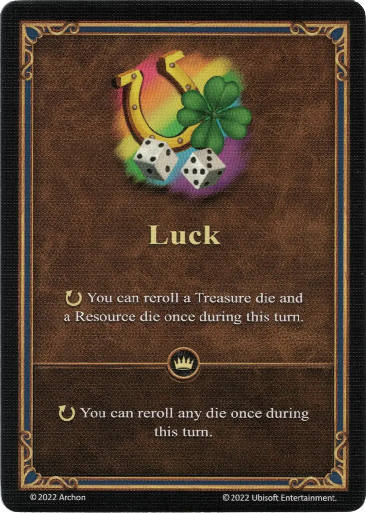

# Suerte

{ width="340" align=right }

___

[Habilidad](index.md)

___

:ongoing: You can reroll a [Tesoro die](../dice.md#treasure-die) and a [Resource die](../dice.md#resource-die) once during this turn.

___

 :expert: 

:ongoing: You can reroll any [die](../dice.md) once during this turn.

___

## Héroes con Habilidad de Inicio

- [:magic: Astra](../heroes/astra.md)
- [:magic: Melodia](../heroes/melodia.md)

## Notas

- El efecto experto permite volver a colocar * cada * dado que el jugador rueda durante todo su turno.Esto incluye cada dado de ataque durante todas las peleas durante su turno.
- Esta habilidad se puede jugar durante el turno de un enemigo, solo en una pelea, y solo si el héroe del jugador se defiende.Solo se puede jugar durante la activación de una unidad amigable.

## Viene Con

- [Juego Principal](../content/core_game.md)

## Ver También

- [Lista de Habilidades](index.md)
- [Dice](../dice.md)
