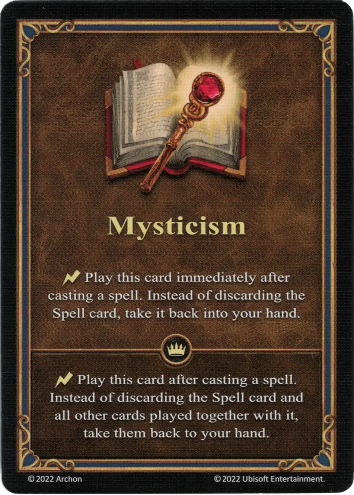

# Misticismo

{ width="340" align=right }

___

[Habilidad](index.md)

___

:instant: Play this card immediately after casting a [spell](../spells/index.md). Instead of discarding the [Spell](../spells/index.md) card, take it back into your hand.

___

 :expert: 

:instant: Play this card immediately after casting a [spell](../spells/index.md). Instead of discarding the [Spell](../spells/index.md) card and all other cards player together with it, take them back to your hand.

___

## Héroes con Habilidad de Inicio

- [:magic: Ingham](../heroes/ingham.md)
- [:might: Torosar](../heroes/torosar.md)

## Viene Con

- [Juego Principal](../content/core_game.md)

## Ver También

- [Lista de Habilidades](index.md)
- [Lista de Hechizos](../spells/index.md)
