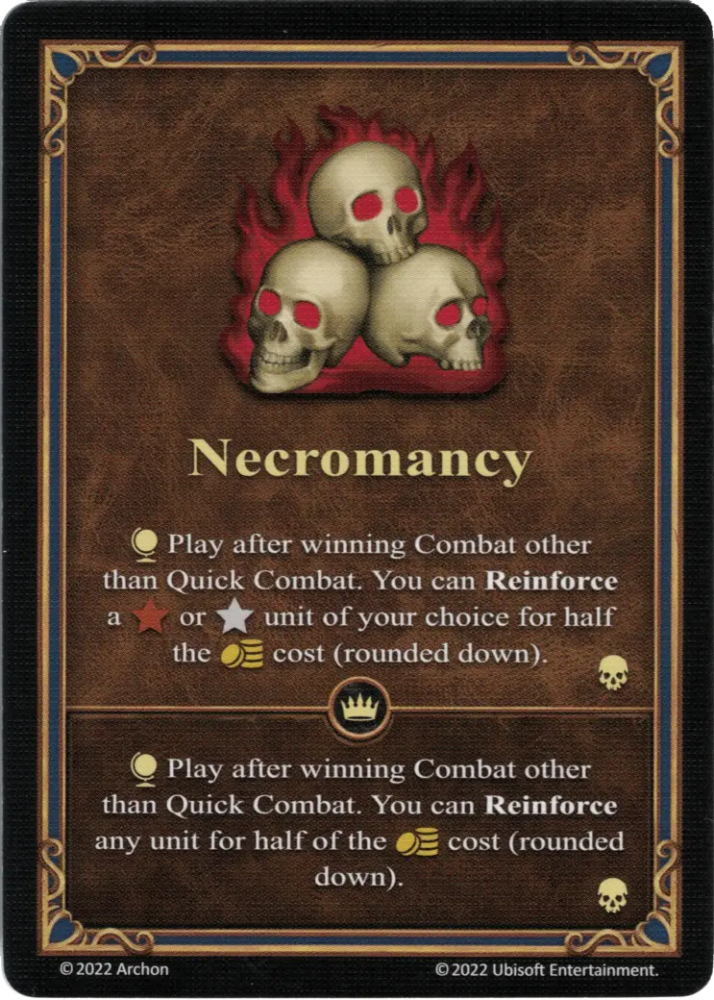

# Nigromancia

{ width="340" align=right }

___

[Habilidad](index.md)

___

:effect_map: Play after winning Combat other than Quick Combat. You can **Reinforce** a :bronze: or :silver: [unit](../units/index.md) of your choice for half the :gold: cost (rounded down).

___

 :expert: 

:effect_map: Play after winning Combat other than Quick Combat. You can **Reinforce** any [unit](../units/index.md) of your choice for half the :gold: cost (rounded down).

___

## Héroes con Habilidad de Inicio

- [:might: Lord Haart (Necropolis)](../heroes/lord_haart_necropolis.md)
- [:might: Moandor](../heroes/moandor.md)
- [:magic: Septienna](../heroes/septienna.md)
- [:magic: Vidomina](../heroes/vidomina.md)

## Viene Con

- [Juego Principal](../content/core_game.md)

## Notas

- Only the heroes belonging to the [Necropolis Faction](../towns/necropolis.md) may play Necromancy.
- Necromancy may only be used to reinforce units that belong to the [Necropolis Faction](../towns/necropolis.md).
- El refuerzo de unidades a través de la nigromancia también puede tener lugar cuando el jugador no tiene la ciudadela construida en su ciudad.
- If a hero that does not belong to the [Necropolis Faction](../towns/necropolis.md) should draw it from the [Habilidad](index.md) deck, they may put it into the discard pile and draw another card instead. They may also choose to keep the card, they may, however, not play it.

## Ver También

- [Lista de Habilidades](index.md)
- [Necropolis Town](../towns/necropolis.md)
