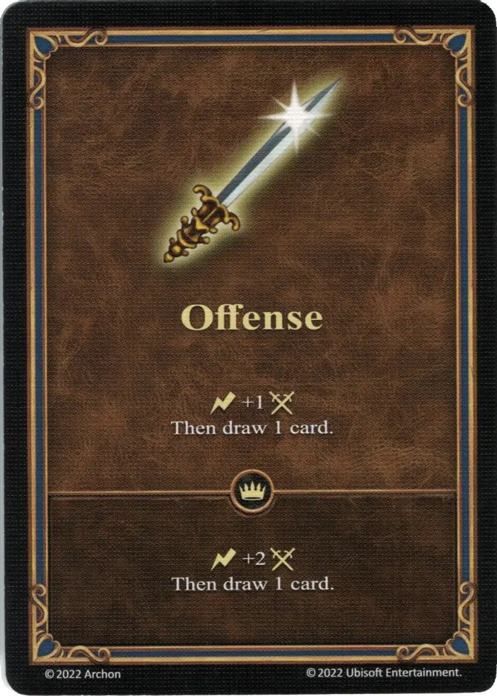

# Ofensiva

{ width="340" align=right }

___

[Habilidad](index.md)

___

:instant: +1 :attack: Then draw 1 card.

___

 :expert: 

:instant: +2 :attack: Then draw 1 card.

___

## Héroes con Habilidad de Inicio

- [:might: Crag Hack](../heroes/crag_hack.md)
- [:might: Ivor](../heroes/ivor.md)
- [:might: Jeremy](../heroes/jeremy.md)
- [:might: Tamika](../heroes/tamika.md)
- [:might: Tarnum (Stronghold)](../heroes/tarnum_stronghold.md)
- [:might: Yog](../heroes/yog.md)

## Notas

- La ofensiva también se puede jugar fuera del combate, para dibujar una carta.En tal caso, el bono de ataque no se usa y se pierde.

## Viene Con

- [Juego Principal](../content/core_game.md)

## Ver También

- [Lista de Habilidades](index.md)
