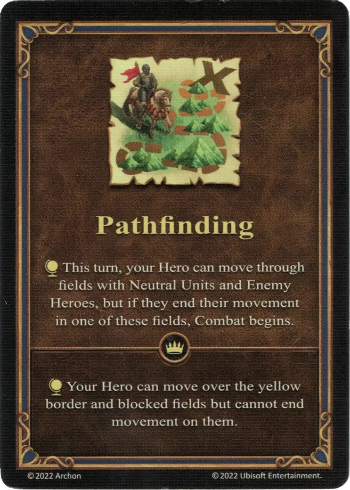

# Orientación

{ width="340" align=right }

___

[Habilidad](index.md)

___

:effect_map: This turn, your Hero can move through fields with Neutral Units and Enemy Heroes, but if they end their movement in one of these fields, Combat begins.

___

 :expert: 

:effect_map: Your Hero can move over the yellow border and blocked fields, but cannot end movement on them.

___

## Héroes con Habilidad de Inicio

- [:might: Clancy](../heroes/clancy.md)

## Notas

- Ver [Zona Bloqueada](../keywords/blocked_field.md)

## Viene Con

- [Expansión de Torre](../content/tower_expansion.md)

## Ver También

- [Lista de Habilidades](index.md)
