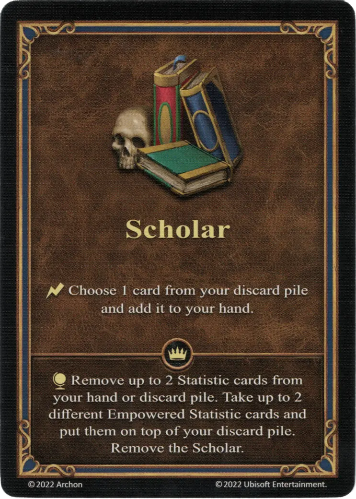

# Erudición

{ width="340" align=right }

___

[Habilidad](index.md)

___

:instant: Choose 1 card from your discard pile and add it to your hand.

___

 :expert: 

:effect_map: Remove up to 2 [Statistic](../statistics/index.md) cards from your hand or discard pile. Take up to 2 different [Empowered Statistic](../statistics/index.md) cards and put them on top of your discard pile. Remove the Erudición.

___

## Héroes con Habilidad de Inicio

- [:might: Octavia](../heroes/octavia.md)
- [:might: Rashka](../heroes/rashka.md)

## Viene Con

- [Expansión de Infierno](../content/inferno_expansion.md)

## Ver También

- [Lista de Habilidades](index.md)
- [Lista de Características](../statistics/index.md)
