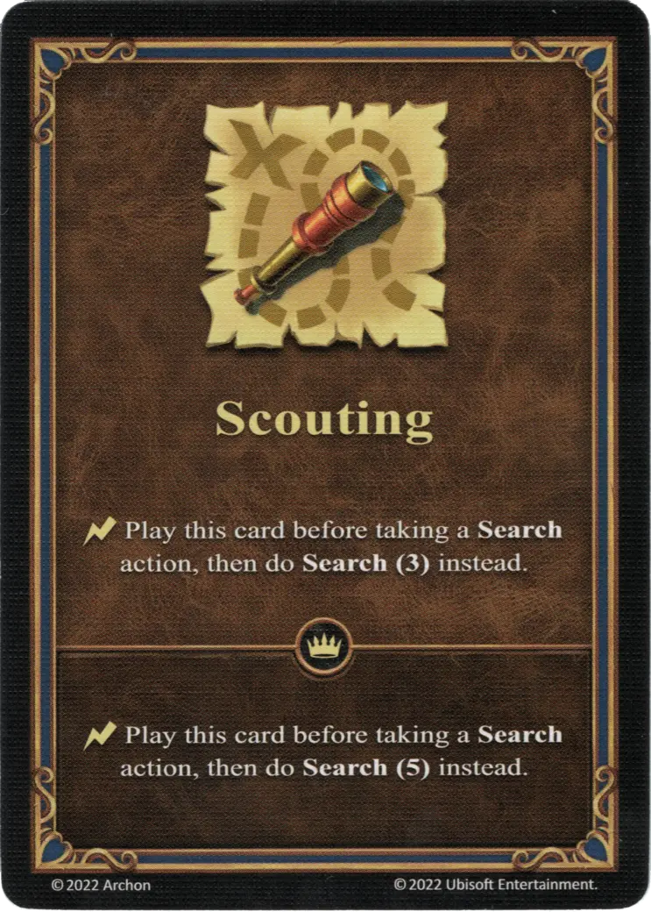

# Exploración

{ width="340" align=right }

___

[Habilidad](index.md)

___

:instant: Play this card before taking a **Search** action, then do **Search(3)** instead.

___

 :expert: 

:instant: Play this card before taking a **Search** action, then do **Search(5)** instead.

___

## Héroes con Habilidad de Inicio

- [:magic: Deemer](../heroes/deemer.md)
- [:might: Fiona](../heroes/fiona.md)
- [:might: Lorelei](../heroes/lorelei.md)
- [:might: Shiva](../heroes/shiva.md)

## Viene Con

- [Expansión de Torre](../content/tower_expansion.md)

## Ver También

- [Lista de Habilidades](index.md)
