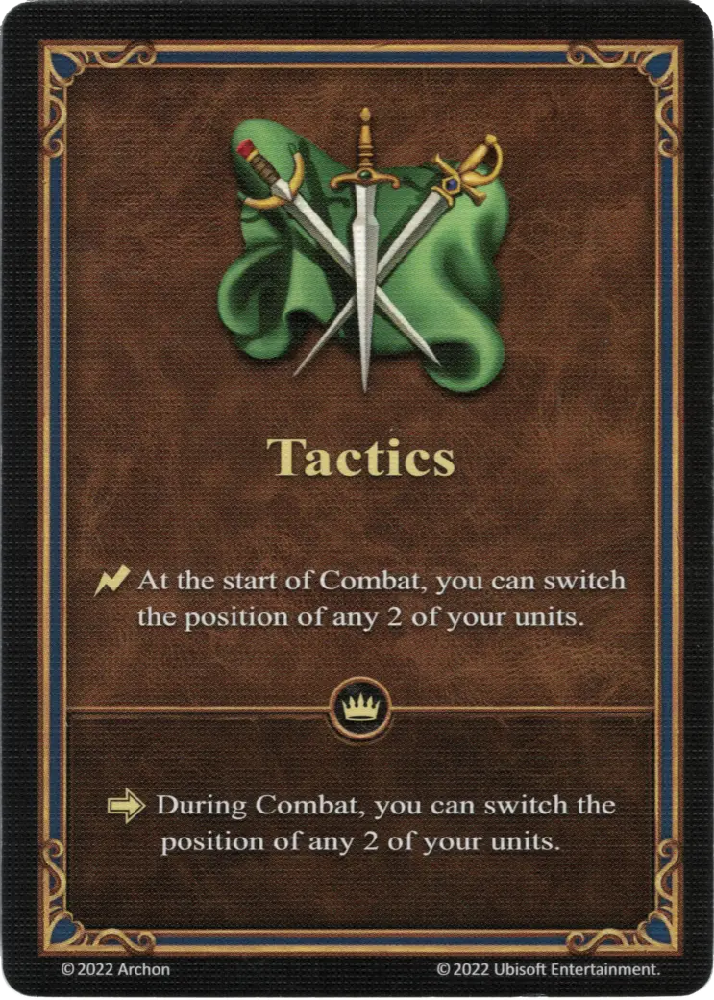

# Táctica

{ width="340" align=right }

___

[Habilidad](index.md)

___

:instant: At the start of Combat, you can switch the position of any 2 of your [units](../units/index.md).

___

 :expert: 

:activation: During Combat, you can switch the position of any 2 of your [units](../units/index.md).

___

## Héroes con Habilidad de Inicio

- [:might: Cassiopeia](../heroes/cassiopeia.md)
- [:might: Mutare](../heroes/mutare.md)

## Viene Con

- [Juego Principal](../content/core_game.md)

## Ver También

- [Lista de Habilidades](index.md)
