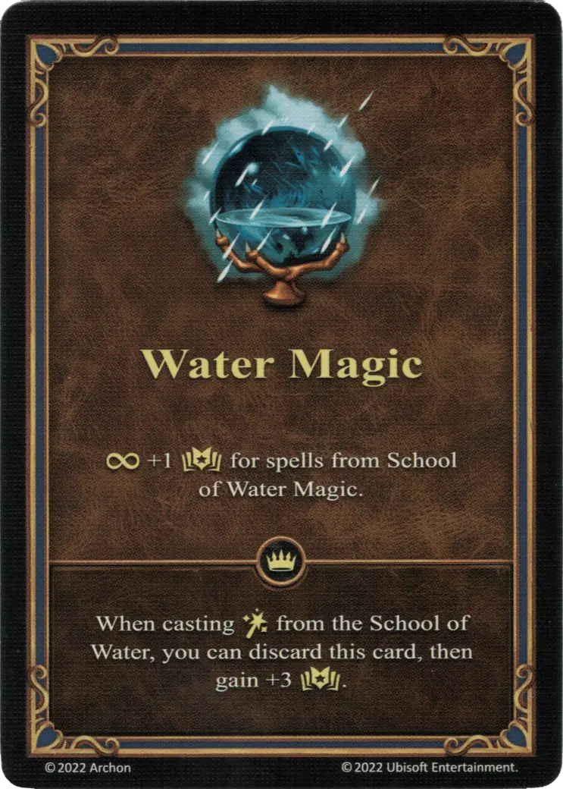

# Magia Acuática

{ width="340" align=right }

___

[Habilidad](index.md)

___

:permanent: +1 :empower: for spells from [School of Water Magic](../spells/school_of_water_magic.md).

___

 :expert: 

While casting :spellpower: from the [School of Water](../spells/school_of_water_magic.md), you can discard this card, then gain +3 :empower:.

___

## Héroes con Habilidad de Inicio

- [:magic: Ciele](../heroes/ciele.md)

## Notas

- El efecto experto puede jugarse desde la mano o desde el campo. Esto, sin embargo, no suma los dos efectos, y la habilidad se pone en la pila de descartes después de ser jugada.
- Ver [Efecto Permanente](../keywords/permanent_effect.md)

## Viene Con

- [Expansión de Torre](../content/tower_expansion.md)

## Ver También

- [Lista de Habilidades](index.md)
- [School of Water Magic](../spells/school_of_water_magic.md)
