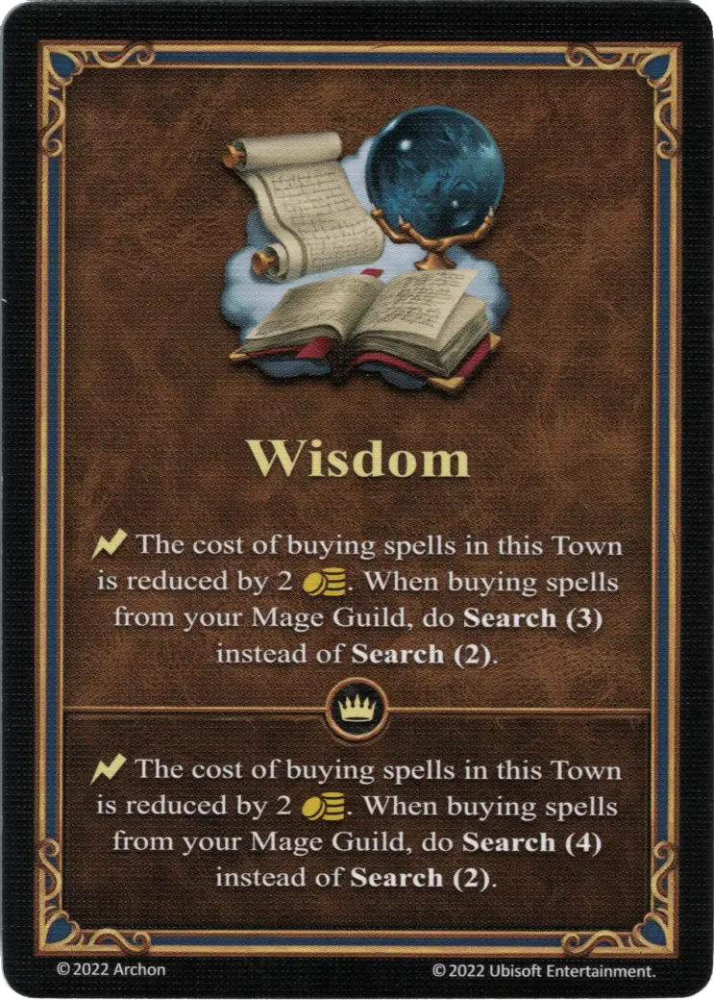

# Sabiduría

{ width="340" align=right }

___

[Habilidad](index.md)

___

:instant: The cost of buying [spells](../spells/index.md) in this Town is reduced by 2 :gold:. When buying [spells](../spells/index.md) from your Magic Guild, do **Search(3)** instead of **Search(2)**.

___

 :expert: 

:instant: The cost of buying [spells](../spells/index.md) in this Town is reduced by 2 :gold:. When buying [spells](../spells/index.md) from your Magic Guild, do **Search(4)** instead of **Search(2)**.

___

## Héroes con Habilidad de Inicio

- [:magic: Adelaide](../heroes/adelaide.md)
- [:magic: Adrienne](../heroes/adrienne.md)
- [:magic: Alamar](../heroes/alamar.md)
- [:magic: Casmetra](../heroes/casmetra.md)
- [:magic: Dracon](../heroes/dracon.md)
- [:magic: Gundula](../heroes/gundula.md)
- [:magic: Rion](../heroes/rion.md)
- [:magic: Tarnum (Conflux)](../heroes/tarnum_conflux.md)
- [:magic: Xyron](../heroes/xyron.md)

## Viene Con

- [Juego Principal](../content/core_game.md)

## Ver También

- [Lista de Habilidades](index.md)
- [Lista de Hechizos](../spells/index.md)
