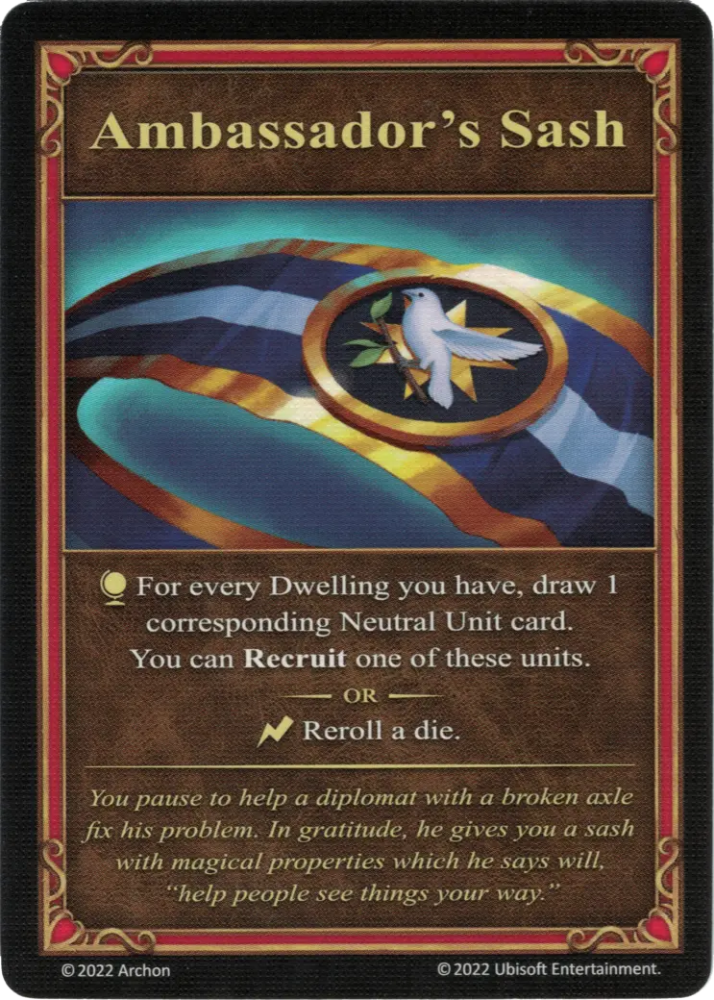

# Banda del Embajador

{ width="340" align=right }
___

[Artefacto Mayor](../keywords/major_artifact.md)

___

:effect_map: Por cada [Vivienda](../towns/index.md) que tengas, descubre 1 carta de la correspondiente [Unidad Neutral](../units/index.md). Puedes **Reclutar** una de estas unidades.  — O —  :instant: Repite la tirada de un [dado](../dice.md).

___

*Te detienes para ayudar a un diplomático con un eje roto a solucionar su problema. En agradecimiento, te regala una faja con propiedades mágicas que dice que te permitirá, "ayudar a la gente a ver las cosas a tu manera."*

## Viene Con

- [Expansión de Muralla](../content/rampart_expansion.md)

## Ver También

- [Lista de Artefactos](index.md)
