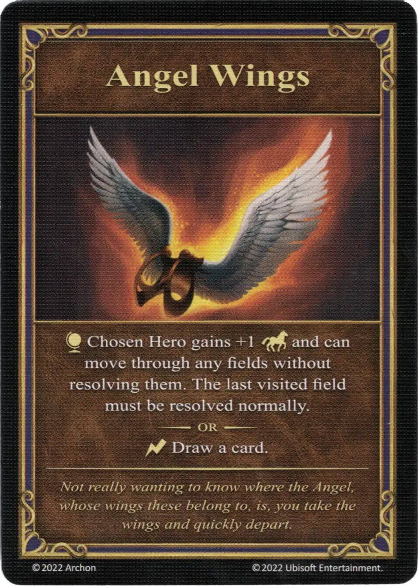

# Alas de Ángel

{ width="340" align=right }
___

[Artefacto Reliquia](../keywords/relic_artifact.md)

___

:effect_map: El [Héroe](../heroes/index.md) elegido gana +1 :movement: y puede moverse a través de cualesquiera lugares sin resolverlos. El último lugar visitado debe ser resuelto con normalidad.  — O —  :instant: Roba una carta.

___

*Sin querer saber realmente donde está el Ángel, a cuyas alas pertecenen, es decir, tomas las alas y te vas rápidamente.*

## Notas

- Después de jugar Alas de Ángel, el Héroe puede moverse a través de las fronteras y los campos bloqueados. Sin embargo, no puede terminar su movimiento en un campo bloqueado.
- Ver [Zona Bloqueada](../keywords/blocked_field.md)

## Viene Con

- [Juego Principal](../content/core_game.md)

## Ver También

- [Lista de Artefactos](index.md)
