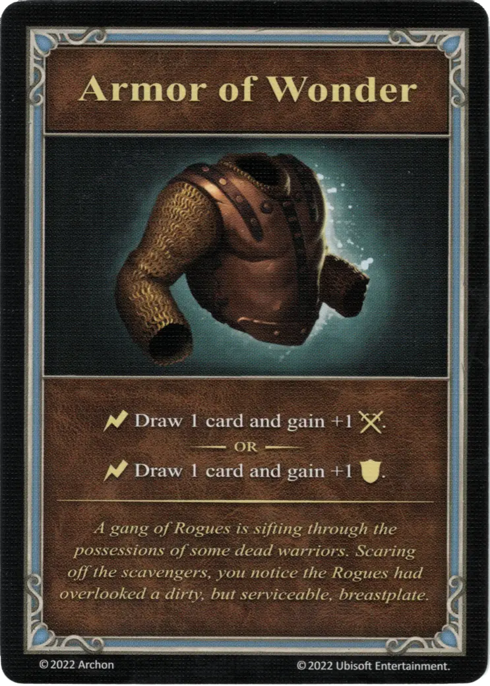

# Armadura Portentosa

{ width="340" align=right }
___

[Artefacto Menor](../keywords/minor_artifact.md)

___

:instant: Roba 1 carta y gana +1 :attack:.  — O —  :instant: Roba 1 carta y gana +1 :defense:.

___

*Una banda de Bandidos está revisando las posesiones de algunos guerreros muertos. Para ahuyentar a los carroñeros, te das cuenta de que los pícaros habían pasado por alto una coraza sucia, pero útil.*

## Viene Con

- [Juego Principal](../content/core_game.md)

## Ver También

- [Lista de Artefactos](index.md)
