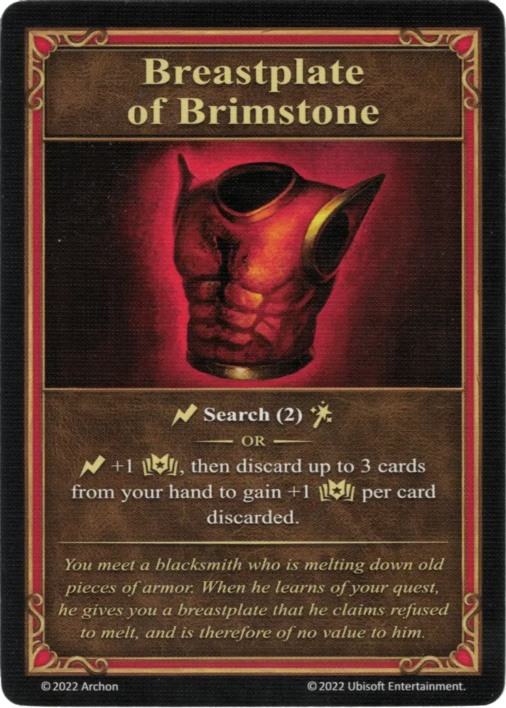

# Peto de Azufre

{ width="340" align=right }
___

[Artefacto Mayor](../keywords/major_artifact.md)

___

:instant: **Busca(../2)** [:spellpower:](../spells/index.md).  — O —  :instant: +1 :empower:, luego descarta hasta 3 cartas de tu mano para ganar +1 :empower: por cada carta descartada.

___

*Te encuentras con un herrero que está fundiendo viejas piezas de armadura. Cuando se entera de tu misión, te da una coraza que, según él, se negó a fundir y, por lo tanto, no tiene ningún valor para él.*

## Viene Con

- [Expansión de Infierno](../content/inferno_expansion.md)

## Ver También

- [Lista de Artefactos](index.md)
