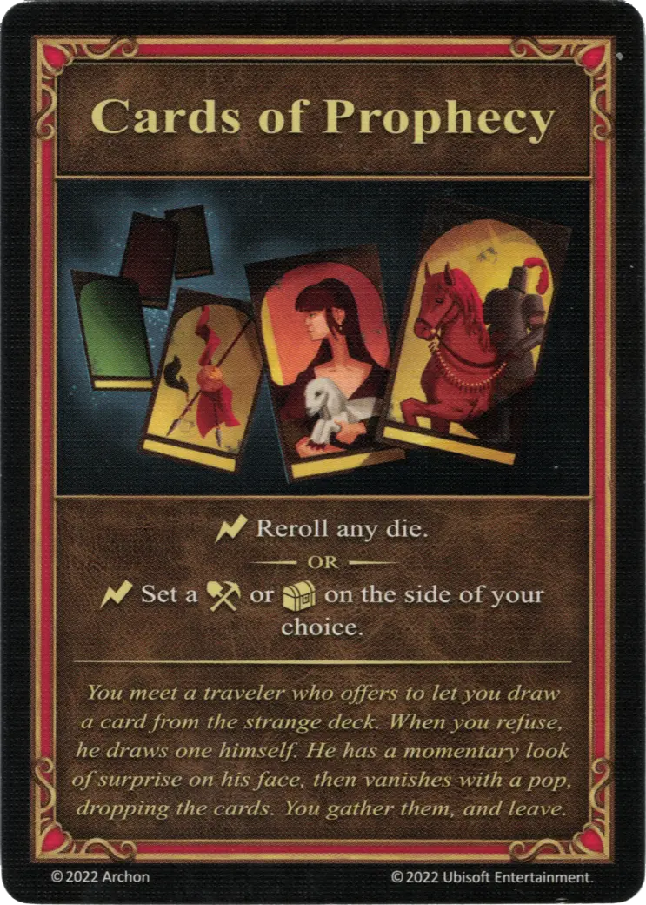

# Cartas de la Profecía

{ width="340" align=right }
___

[Artefacto Mayor](../keywords/major_artifact.md)

___

:instant: Repite cualquier [dado](../dice.md).  — O —  :instant: Coloca un dado de :resource_die: o :treasure: por el lado de tu elección.

___

*Te encuentras con un viajero que te ofrece robar una carta de la extraña baraja. Cuando te niegas, él mismo saca una. Pone cara de sorpresa y desaparece con un chasquido, dejando caer las cartas. Las recoges y te marchas.*

## Viene Con

- [Expansión de Torre](../content/tower_expansion.md)

## Ver También

- [Lista de Artefactos](index.md)
