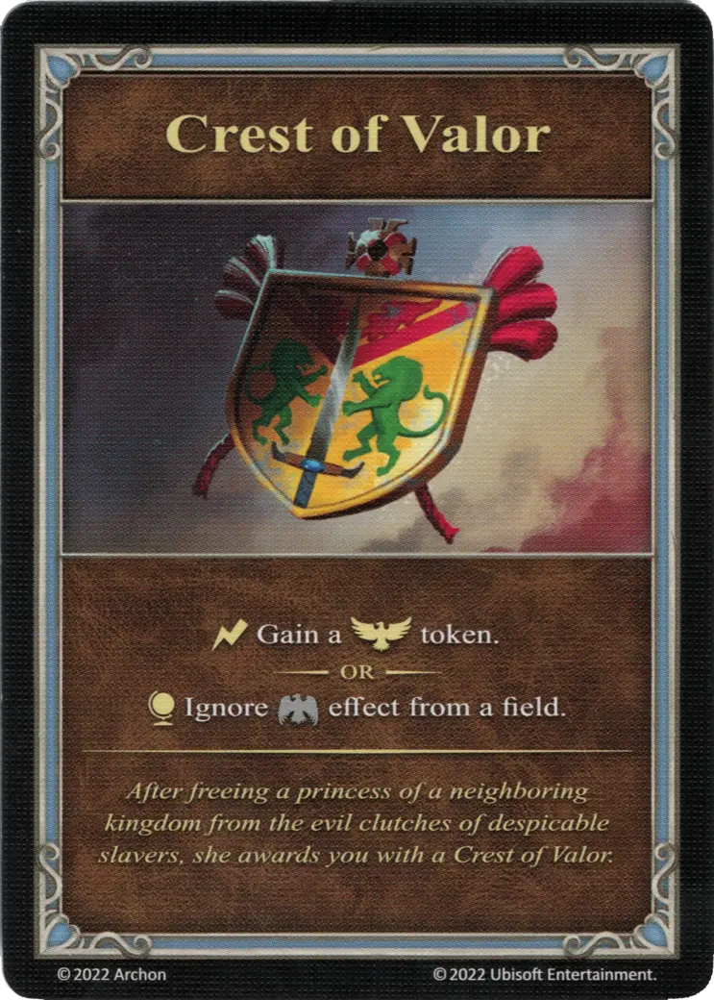

# Blasón del Valor

{ width="340" align=right }
___

[Artefacto Menor](../keywords/minor_artifact.md)

___

:instant: Gana una ficha de :morale_positive:.  — O —  :effect_map: Ignora el efecto de :morale_negative: de una casilla.

___

*Tras liberar a la princesa de un reino vecino de las garras de unos despreciables esclavistas, ella te otorga un Blasón del Valor.*

## Viene Con

- [Expansión de Fortaleza](../content/fortress_expansion.md)

## Ver También

- [Lista de Artefactos](index.md)
