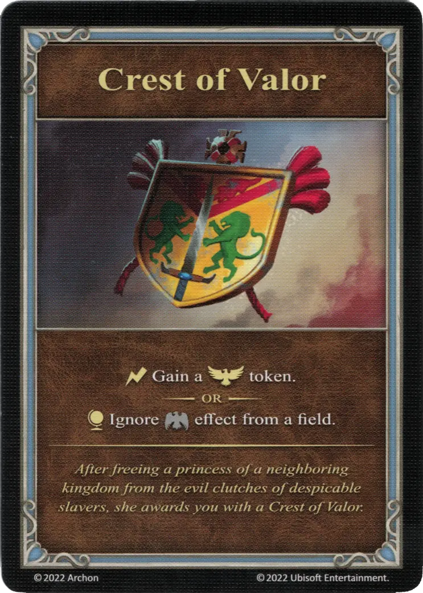

# Blasón del Valor

{ width="340" align=right }
___

[Minor Artifact](index.md#minor-artifacts)

___

:instant: Gain a :positive_morale: token.  — OR —  :map_effect: Ignore :negative_morale: effect from a field.

___

*Tras liberar a la princesa de un reino vecino de las garras de unos despreciables esclavistas, ella te otorga un Blasón del Valor.*

## Viene Con

- [Expansión de Fortaleza](../content/fortress_expansion.md)

## Ver También

- [Lista de Artefactos](index.md)
