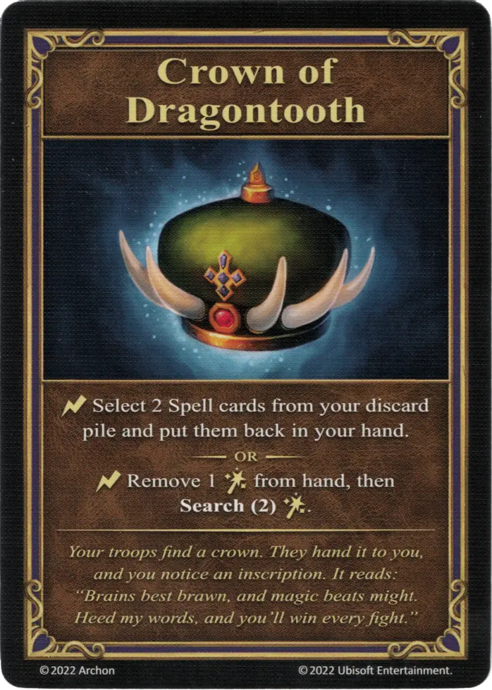

# Corona de Dientes de Dragón

{ width="340" align=right }
___

[Artefacto Reliquia](../keywords/relic_artifact.md)

___

:instant: Selecciona 2 cartas de [Hehizol](../spells/index.md) de tu pila de descarte y devuélvelas a tu mano.  — O —  :instant: Retira 1 [:spellpower:](../spells/index.md) de tu mano, luego **Buscar(2)** [:spellpower:](../spells/index.md).

___

*Tus tropas encuentran una corona. Te la entregan y te fijas en una inscripción. Dice así: "La inteligencia es mejor que la fuerza, y la magia vence a la fuerza. Presta atención a mis palabras y ganarás todos los combates."*

## Viene Con

- [Expansión de Infierno](../content/inferno_expansion.md)

## Ver También

- [Armadura de Escamas de Dragón](dragon_scale_armor.md)
- [Escudo de Escamas de Dragón](dragon_scale_shield.md)
- [Tabardo de Ala de Dragón](dragon_wing_tabard.md)
- [Collar de Dientes de Dragón](necklace_of_dragonteeth.md)
- [Lengua Ígnea del Dragón Rojo](red_dragon_flame_tongue.md)

- [Lista de Artefactos](index.md)
