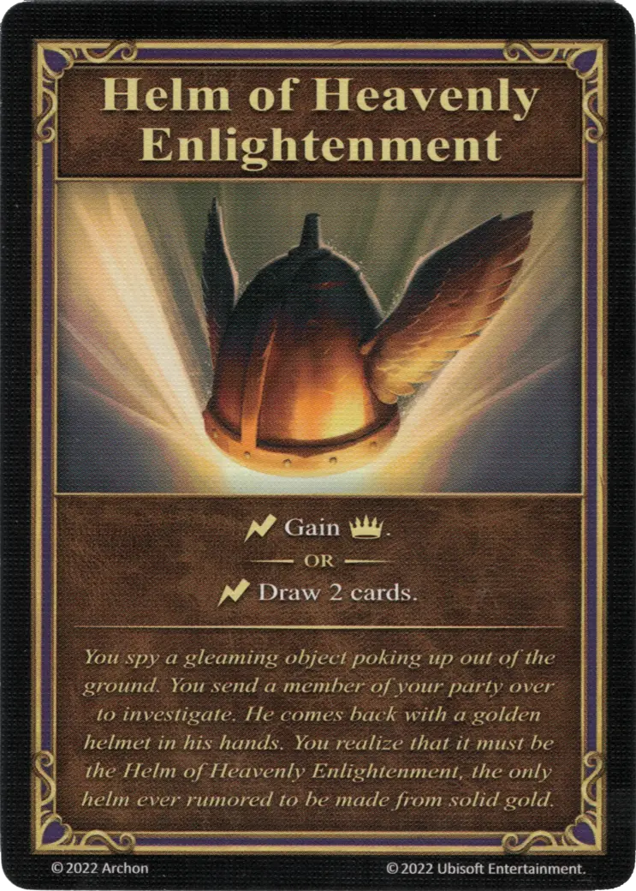

# Yelmo de la Divina Iluminación

{ width="340" align=right }
___

[Artefacto Reliquia](../keywords/relic_artifact.md)

___

:instant: Gana :expert:.  — O —  :instant: Roba 2 cartas.

___

*Ves un objeto brillante que sobresale del suelo. Envías a un miembro de tu grupo a investigar. Regresa con un yelmo dorado en las manos. Te das cuenta de que debe de ser el Yelmo de la Divina Iluminación, el único yelmo del que se rumorea que está hecho de oro macizo.*

## Viene Con

- [Expansión de Fortaleza](../content/fortress_expansion.md)

## Ver También

- [Lista de Artefactos](index.md)
