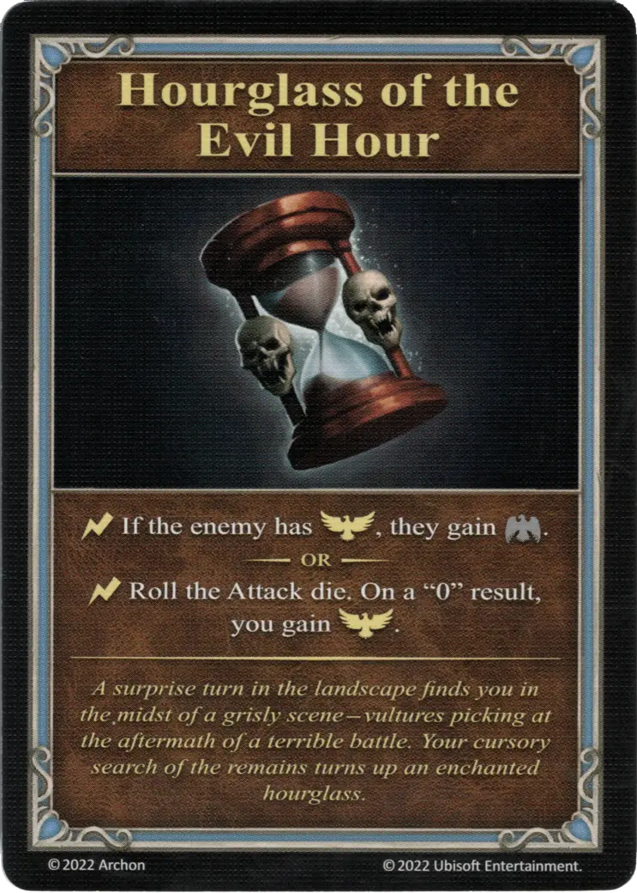

# Reloj de Arena de la Hora Aciaga

{ width="340" align=right }
___

[Minor Artifact](index.md#minor-artifacts)

___

:instant: If the enemy has :positive_morale:, they gain :negative_morale:.  — OR —  :instant: Roll the [Attack die](../keywords/dice.md#attack-die). On a "0" result, you gain :positive_morale:.

___

*Un giro inesperado en el paisaje te encuentra en medio de una escena espeluznante: buitres hurgando en los despojos de una terrible batalla. Al buscar entre los restos, encuentras un reloj de arena encantado.*

## Viene Con

- [Juego Principal](../content/core_game.md)

## Ver También

- [Lista de Artefactos](index.md)
