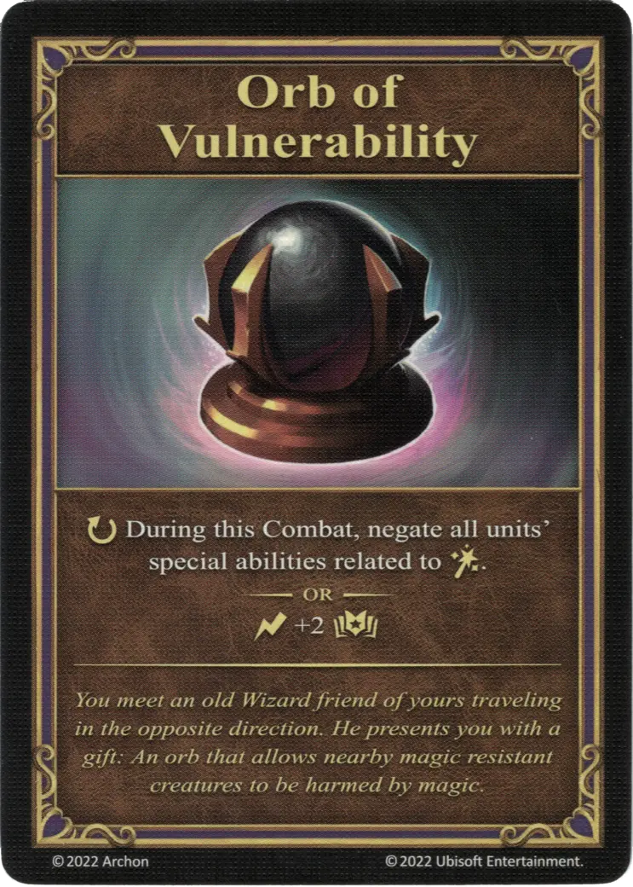

# Orbe de Vulnerabilidad

{ width="340" align=right }
___

[Artefacto Reliquia](../keywords/relic_artifact.md)

___

:ongoing: During this Combat, negate all [units'](../units/index.md) special abilities related to [:spellpower:](../spells/index.md).  — OR —  :instant: +2 :empower:

___

*You meet an old Wizard fiend of yours traveling in the opposite direction. He presents you with a gift: An orb that allows nearby magic resistant creatures to be harmed by magic.*

## Viene Con

- [Expansión de Muralla](../content/rampart_expansion.md)

## Ver También

- [Lista de Artefactos](index.md)
