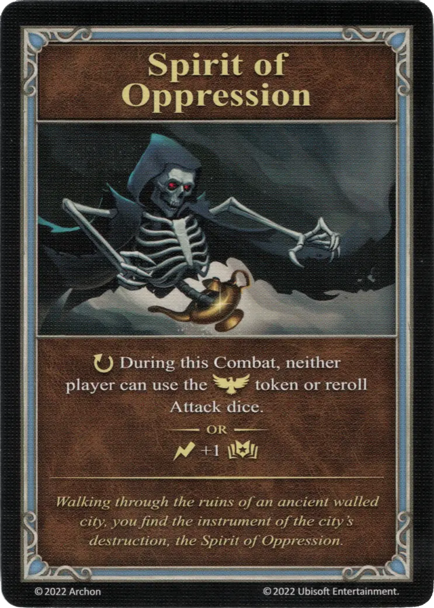

# Espíritu de Opresión

{ width="340" align=right }
___

[Artefacto Menor](../keywords/minor_artifact.md)

___

:ongoing: During this Combat, neither player can use the :morale_positive: token or reroll [Attack dice](../dice.md#attack-die).  — OR —  :instant: +1 :empower:

___

*Walking through the ruins of an ancient walled city, you find the instrument of the city's destruction, the Espíritu de Opresión.*

## Viene Con

- [Expansión de Fortaleza](../content/fortress_expansion.md)

## Ver También

- [Lista de Artefactos](index.md)
