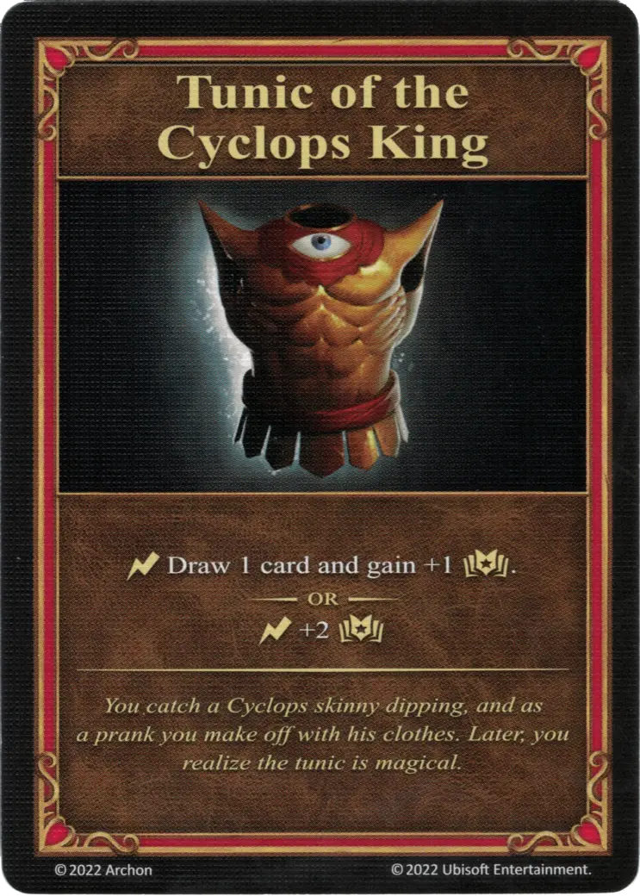

# Túnica del Rey Cíclope

{ width="340" align=right }
___

[Artefacto Mayor](../keywords/major_artifact.md)

___

:instant: Draw 1 card and gain +1 :empower:.  — OR —  :instant: +2 :empower:

___

*You catch a Cyclops skinny dipping, and as a prank you make off with his clothes. Later, you realize the tunic is magical.*

## Viene Con

- [Juego Principal](../content/core_game.md)

## Ver También

- [Lista de Artefactos](index.md)
