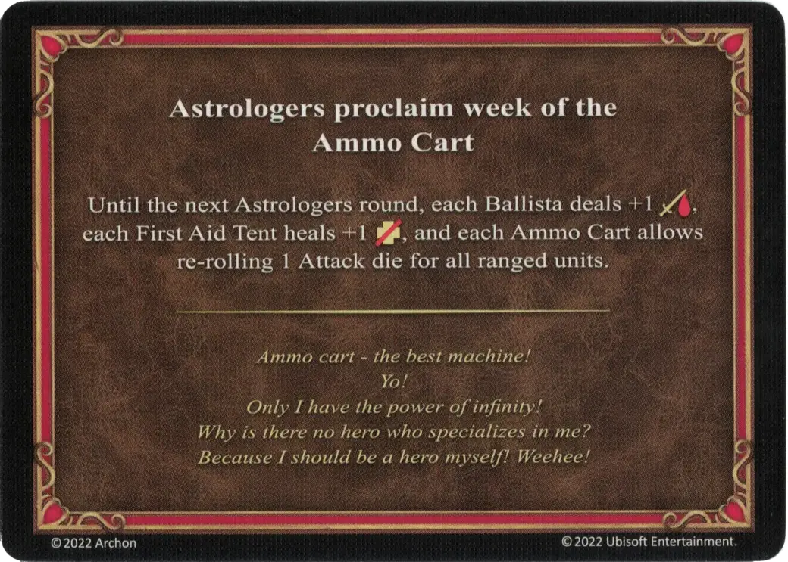

# Carro de Munición

<figure markdown="span">

{ width="475" align=right }

</figure>

___

[Proclama de los Astrólogos](index.md)

___

Hasta la siguiente ronda de Astrólogos, cada [Ballesta](../war_machines/ballista.md) realiza +1 :damage:, cada [Tienda de Primeros Auxilios](../war_machines/first_aid_tent.md) cura +1 :health_points:‍, y cada [Carro de Munición](../war_machines/ammo_cart.md) permite repetir 1 [Dado de Ataque](../dice.md#attack-die) para todas las [unidades](../units/index.md) a distancia.

___

*Carro de Munición - ¡la mejor máquina! ¡Yo! ¡Solo yo tengo el poder del infinito! ¿Por qué no hay un héroe que se especialice en mi? ¡Porque yo mismo debería ser un héroe! ¡Weehee!*

___

## Notas

- Si se usa el efecto experto de [Artillería](../abilities/artillery.md) durante esta semana, inflingirá 3 veces 2 de daño, es decir, 6 de daño en total.

## Viene Con

- [Expansión de Muralla](../content/rampart_expansion.md)

## Ver También

- [Lista de Cartas de los Astrólogos](index.md)
- [Lista de Máquinas de Guerra](../war_machines/index.md)
