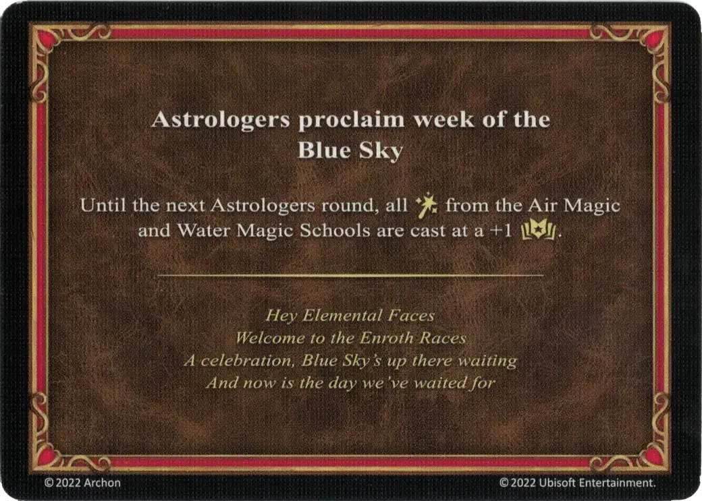

# Cielo Azul

<figure markdown="span">

{ width="475" align=right }

</figure>

___

[Proclama de los Astrólogos](index.md)

___

Hasta la siguiente ronda de Astrólogos, todos los [:spellpower:](../spells/index.md) de las Escuelas [Magia Aérea](../spells/school_of_air_magic.md) y [Magia Acuática](../spells/school_of_water_magic.md) son lanzados con +1 :empower:.

___

*Hola Caras de Elemental Bienvenidos a las Carreras de Enroth Una celebración, El Cielo Azul nos espera ahí arriba Y ahora es el día que nosotros esperábamos*

___

## Viene Con

- [Expansión de Torre](../content/tower_expansion.md)

## Ver También

- [Lista de Cartas de los Astrólogos](index.md)
- [Lista de Hechizos](../spells/index.md)
