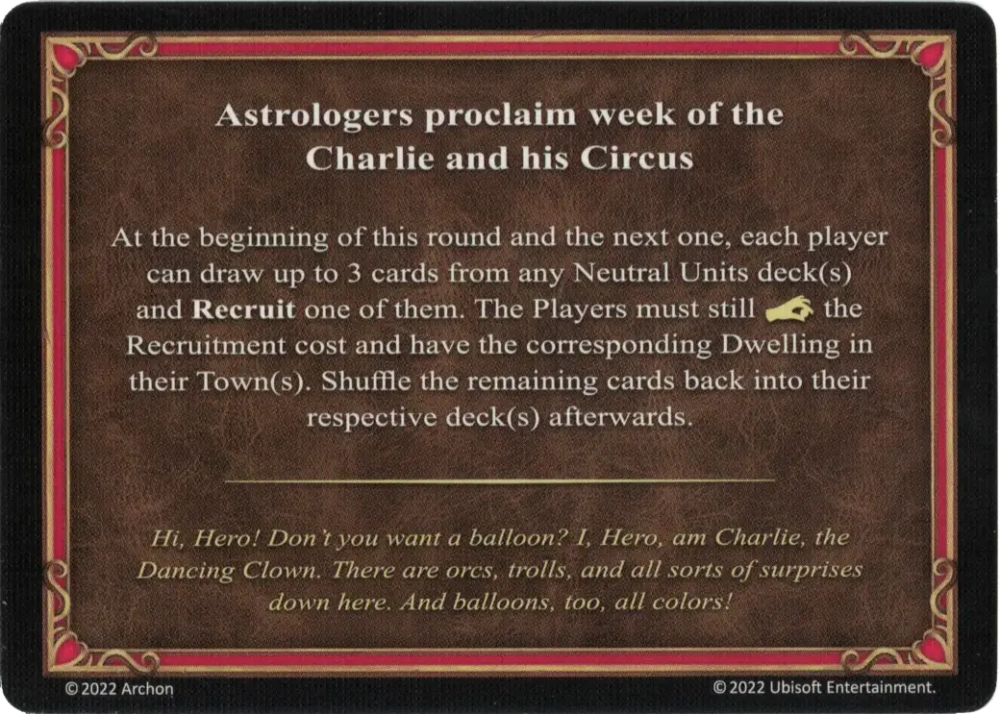

# Charlie y su Circo

<figure markdown="span">

{ width="475" align=right }

</figure>

___

[Proclama de los Astrólogos](index.md)

___

Al principio de esta ronda y de la siguiente, cada jugador puede robar hasta 3 cartas de cualquier mazo de [Unidades Neutrales](../units/index.md) y **Reclutar** una de ellas. Los Jugadores aún deben :pay: el coste de reclutamiento y tener la [Vivienda](../towns/index.md) correspondiente en su [Ciudad](../towns/index.md). Baraja después las cartas restantes en su mazo correspondiente.

___

*¡Hola, Héroe! ¿No quieres un globo? Yo, Héroe, soy Charlie, el Payaso Bailarín. Hay orcos, trolls y todo tipo de sorpresas aquí abajo. Y globos también, ¡de todos los colores!*

___

## Notas

- Las unidades :azure: no pueden ser reclutadas a través de esta carta.
- [^1] Cuando se juega con miniaturas (ej. cuando se juega en el gran campo de batalla), esta habilidad no puede utilizarse para reclutar unidades de una facción controlada por otro jugador, ni para reclutar unidades neutrales que ya estén reclutadas por otro jugador. Si un jugador roba una carta de este tipo, que no puede ser reclutada, deberá robar una carta de reemplazo en su lugar.

## Viene Con

- [Expansión de Muralla](../content/rampart_expansion.md)

## Ver También

- [Lista de Cartas de los Astrólogos](index.md)
- [Lista de Ciudades](../towns/index.md)
- [Lista de Unidades](../units/index.md)

[^1]: Excepciones para modos de juego específicos. Esta explicación no es válida para todos los modos de juego. La variante específica para el modo de juego se menciona en el texto.
