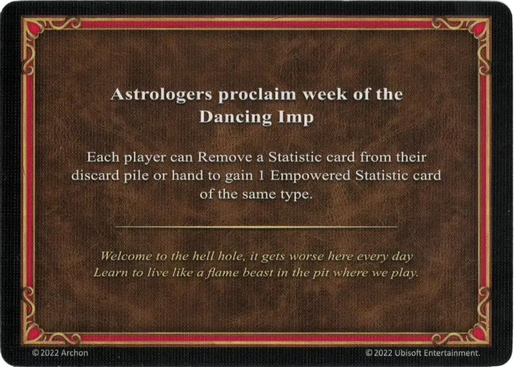

# Gnomo Bailarín

<figure markdown="span">

{ width="475" align=right }

</figure>

___

[Proclama de los Astrólogos](index.md)

___

Cada jugador puede Retirar una carta de [Característica](../statistics/index.md) de su pila de descartes o de su mano para ganar 1 carta de [Característica Potenciada](../statistics/index.md) del mismo tipo.

___

*Bienvenido al agujero del infierno, se pone peor aquí cada día. Aprende a vivir como una bestia de fuego en el pozo donde jugamos.*

___

## Viene Con

- [Expansión de Infierno](../content/inferno_expansion.md)

## Ver También

- [Lista de Cartas de los Astrólogos](index.md)
- [Lista de Características](../statistics/index.md)
