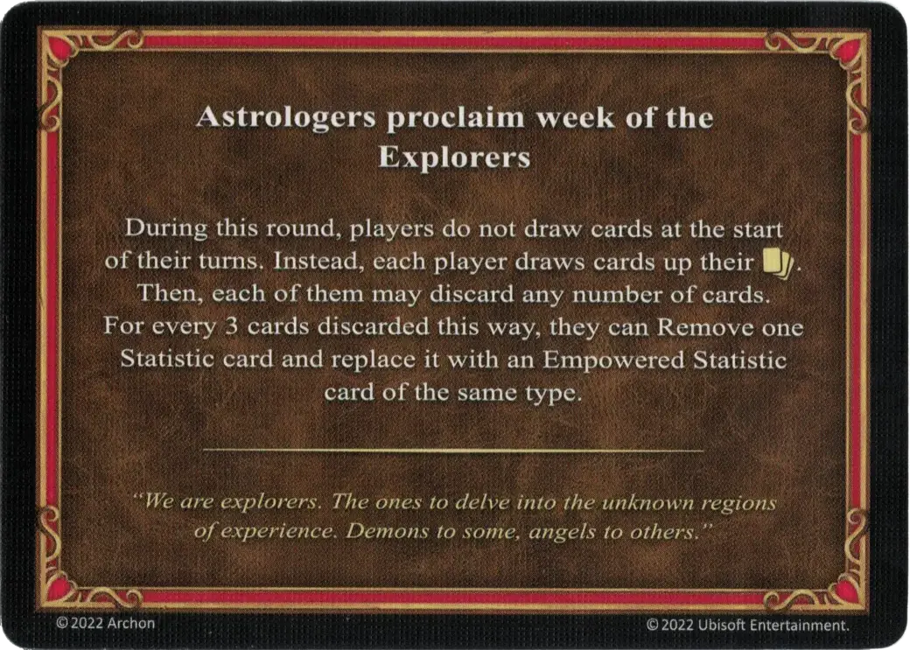

# Exploradores

<figure markdown="span">

{ width="475" align=right }

</figure>

___

[Proclama de los Astrólogos](index.md)

___

During this round, players do not draw cards at the start of their turns. Instead, each player draws cards up their :hand_limit:. Then, each of them may discard any number of cards. For every 3 cards discarded this way, they can Remove one [Statistic](../statistics/index.md) card and replace it with an [Empowered Statistic](../statistics/index.md) card of the same type.

___

*"Somos exploradores. Los que se adentran en las regiones desconocidas de la experiencia. Demonios para unos, ángeles para otros."*

___

## Notas

- [^1] La [Característica](../statistics/index.md) eliminada debe proceder de la mano del jugador. Al coger la [Característica] Potenciada(../statistics/index.md), el jugador la añade a su mano.

## Viene Con

- [Expansión de Infierno](../content/inferno_expansion.md)

## Ver También

- [Lista de Cartas de los Astrólogos](index.md)
- [Lista de Características](../statistics/index.md)

[^1]: Not officially confirmed by game designers, and is therefore considered a Community rule.
