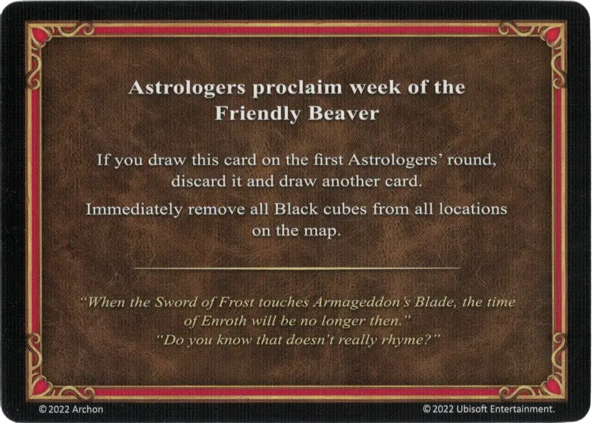

# Castor Amistoso

<figure markdown="span">

{ width="475" align=right }

</figure>

___

[Proclama de los Astrólogos](index.md)

___

Si robas esta carta en la primera ronda de Astrólogos, descártala y roba otra carta.  Elimina inmediatamente todos los cubos negros de todas las ubicaciones del mapa.

___

*"Cuando la Espada de Escarcha toque la Hoja de Armagedón, el tiempo de Enroth dejará de existir entonces." "¿Sabes que en realidad no rima?"*

___

## Notas

- Sólo se eliminan los cubos negros, los cubos de facción de color permanecen en los campos (ej. minas).
- Una segunda ficha de grial no puede entrar en juego con esta carta, aunque el campo con el grial volviera a ser visitable.

## Viene Con

- [Juego Principal](../content/core_game.md)

## Ver También

- [Lista de Cartas de los Astrólogos](index.md)
