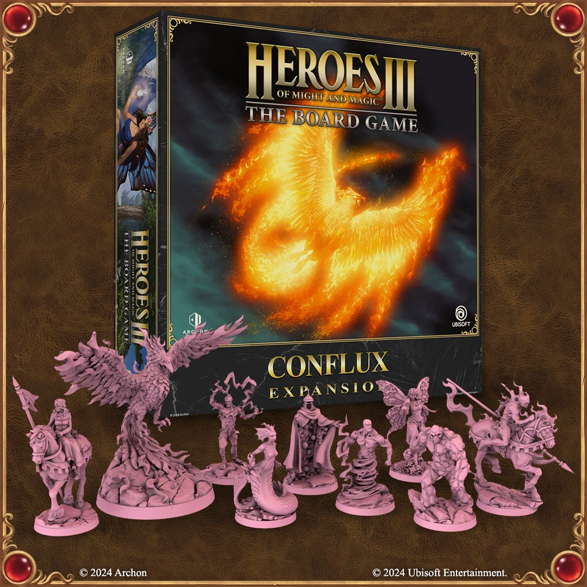
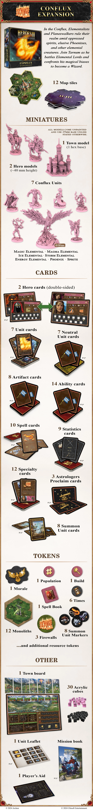

# Expansión de Conflujo

<figure markdown="span">
	{ width=540 align=right }
</figure>
<figure markdown="span">
	{ width=540 align=right }
</figure>

## Dentro de la Caja

- *Sin Publicar*
- [Facción Conflujo](../towns/conflux.md)
- Monolitos

## Ver También

- [List of Content](index.md)
