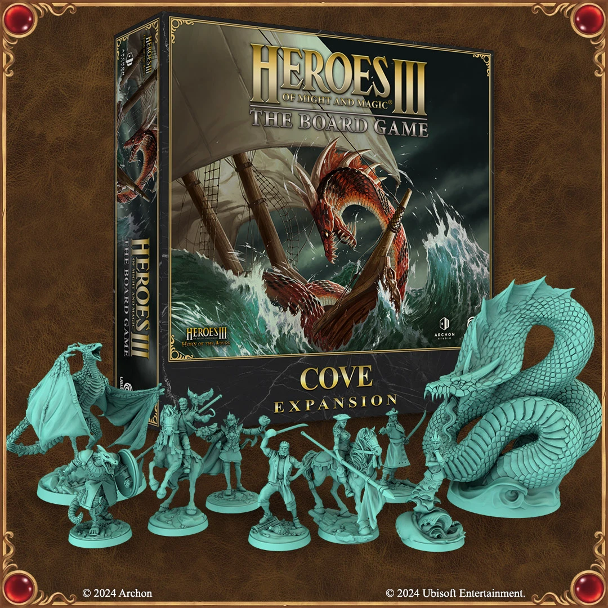
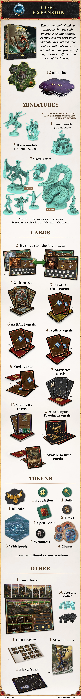

# Expansión de Ensenada

<figure markdown="span">
	{ width=540 align=right }
</figure>
<figure markdown="span">
	{ width=540 align=right }
</figure>

## Dentro de la Caja

- *Próxima Expansión*
- [Facción Ensenada](../towns/cove.md)
- [Losetas de Agua](../tiles/index.md)

## Ver También

- [List of Content](index.md)
