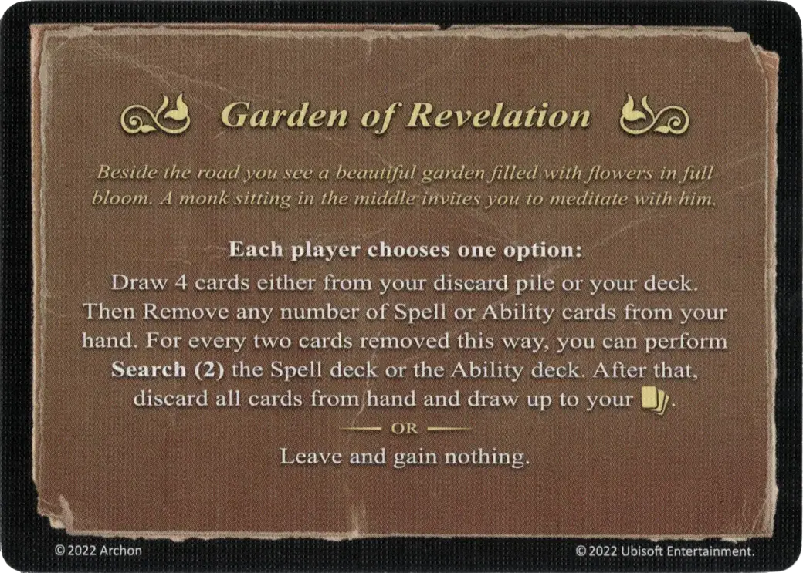

# Jardín de Apocalipsis

<figure markdown="span">

{ width="475" align=right }

</figure>

___

[Evento](index.md)

___

**Each player chooses one option:**  Draw 4 cards either from your discard pile or your deck. Then Remove any number of [Spell](../spells/index.md) or [Ability](../abilities/index.md) cards from your hand. For every two cards removed  this way, you can perform **Search(2)** the [Spell](../spells/index.md) deck or the [Ability](../abilities/index.md) deck. After that, discard all cards from hand and draw up to your :hand_limit:.  — OR —  Leave and gain nothing.

___

*Junto al camino ves un hermoso jardín lleno de flores en plena floración. Un monje sentado en el centro te invita a meditar con él.*

___

## Viene Con

- [Expansión de Fortaleza](../content/fortress_expansion.md)

## Ver También

- [Lista de Habilidades](../abilities/index.md)
- [Lista de Eventos](index.md)
- [Lista de Hechizos](../spells/index.md)
