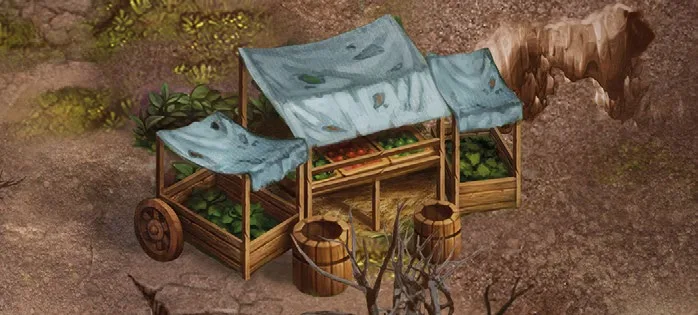

# Mercado Negro

<figure markdown="span">

{ width="475" align=right }

</figure>

___

[Lugar Revisitable](../keywords/revisitable_field.md)

___

Mira las 4 primeras cartas de la Pila de Descarte de [Artefactos](../artifacts/index.md). Puedes comprar una de ellas por:  5 :gold: si es un [Artefacto Menor](../keywords/minor_artifact.md) 7 :gold: si es un [Artefacto Mayor](../keywords/major_artifact.md) 10 :gold: si es un [Artefacto Reliquia](../keywords/relic_artifact.md)

___

## Ver También

- [Lista de Lugares](index.md)
- [Lista de Losetas](../tiles/index.md)
