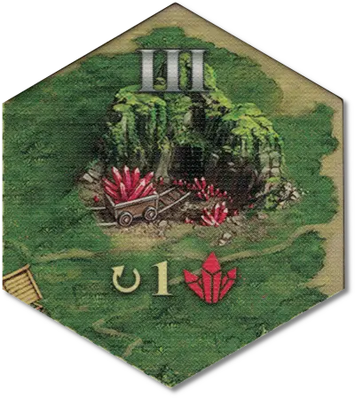

# Mina

<figure markdown="span">

{ width="340" align=right }

</figure>

___

[Zona Señalizable](../keywords/flaggable_field.md)

___

When flagged, increases the specific resource income (shown on the field). The first player to flag the Mina also gains its income immediately. There are following types of Minas:  +5 :gold: income +2 :building_materials: income +1 :valuables: income

___

## Ver También

- [Lista de Lugares](index.md)
- [Lista de Losetas](../tiles/index.md)
