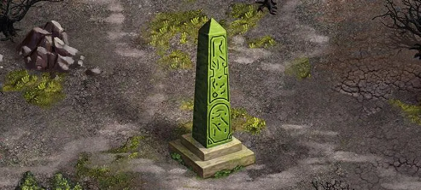

# Obelisco

<figure markdown="span">

{ width="475" align=right }

</figure>

___

[Zona Señalizable](../keywords/flaggable_field.md)

___

Effects depend on the Scenario. When you Flag this Field, do not remove any enemy Faction Cubes; multiple players may have a [Faction](../towns/index.md) Cube on this Field.

___

## Ver También

- [Lista de Lugares](index.md)
- [Lista de Losetas](../tiles/index.md)
