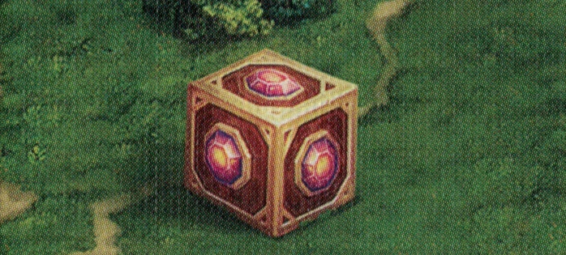

# Caja de Pandora

<figure markdown="span">

{ width="475" align=right }

</figure>

___

[Lugar Visitable](../keywords/visitable_field.md)

___

Roll 2 [Tesoro Dice](../dice.md#treasure-die) and choose 1 result to gain.  — OR —  Roll 2 [Dados de Recurso](../dice.md#resource-die) and choose 1 result to gain.

___

## Ver También

- [Lista de Lugares](index.md)
- [Lista de Losetas](../tiles/index.md)
