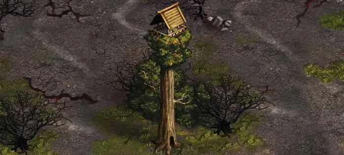

# Observatorio de Caoba

<figure markdown="span">

{ width="475" align=right }

</figure>

___

[Lugar Visitable](../keywords/visitable_field.md)

___

Discover a face down [Tile](../tiles/index.md) adjacent to this one.

___

## Ver También

- [Lista de Lugares](index.md)
- [Lista de Losetas](../tiles/index.md)
